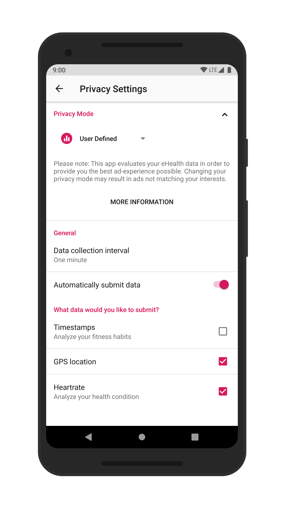

## eHealth App-Demo

This is a mobile e-health demo-application which focuses on improved privacy options compared to currently available applications. Its key features are so called “Privacy Modes” which give the user control over how their personal data is used by the respective fitness company.

The application collects fitness data in form of “Sessions” and stores them locally on the user’s device. It  can then be viewed and managed via the app. Sessions currently include the user’s pulse and some metadata such as timestamps and location whereby the latter is used to display workouts in a Google map.

**A full specification of the app will be published in this repositrory soon.**

### Screenshots

	
	
	
	

